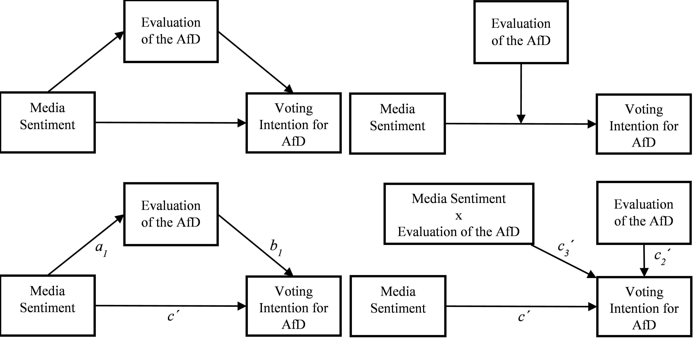
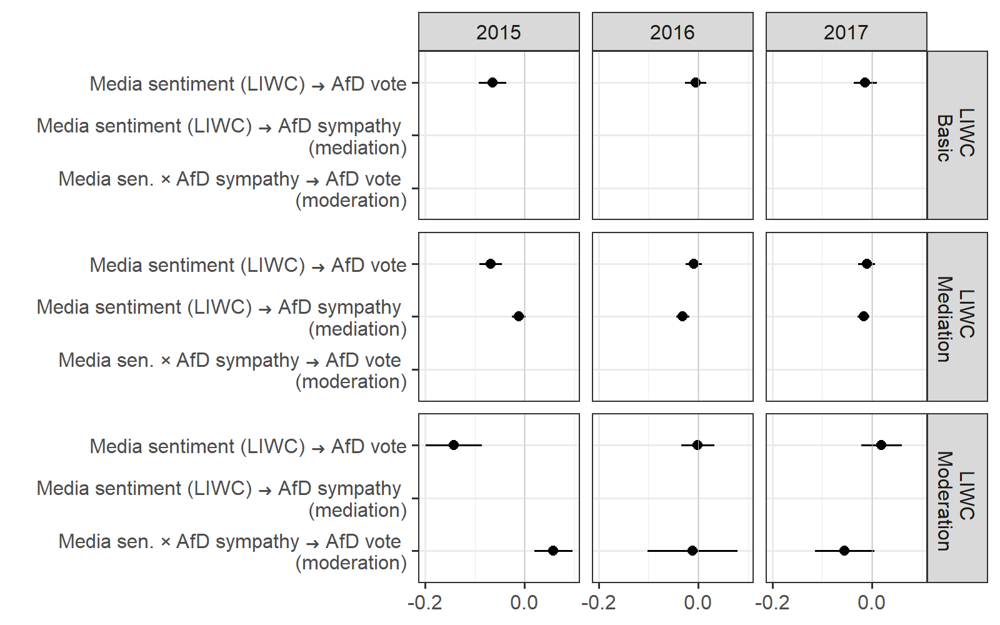

<!-- README.md is generated from README.Rmd -->

```{r, echo = FALSE}
knitr::opts_chunk$set(
  collapse = TRUE,
  comment = "#>",
  fig.path = "README-"
)
```

# Media Sentiment and Party Support

This study attempts to further our understanding of how media sentiment influences voting intentions for right-wing populist parties. Previous research has discussed persuasion and backfire effects in that regard. Drawing on these findings, we demonstrate theoretically, that party evaluation may link media with voting intentions either as a mediator or as a moderator. Repeated cross-sectional German survey data from 2015 to 2017 and an extensive media sentiment analysis from more than 6000 articles enables us to profoundly test these assumptions empirically. Using structural equation modelling, our results indicate, that more negative press coverage is rather associated with higher voting intentions for the right-wing populist party ‘AfD’, yielding support for backfire effects. Additionally, the results show temporal differences. While party evaluation acts as a moderator for the association between media and voting intentions in 2015, the mediation is significant for the following two years. We briefly discuss possible avenues for future research to explain this change such as a possible change in the party´s ideology or its further establishment. Collectively, these results testify to the importance of party evaluation as key contextual sources of media sentiment on voting intentions.

Please see the manuscript in this folder for the complete draft. Please also note that results are preliminary.

## Model and main results



Figure 1: Illustration of our models in conceptual form (upper row) and statistical form (bottom row). Left column shows the mediation, right column the moderation model.



Figure 2: Forest plot illustrating the effect across different years and dictionaries. The direct effect of party sympathy on voting intentions is not reported as it is always outside the displayed scale, but significantly positive in every analysis.


___
Please cite the complete manuscript, available in this folder, when referring to this research as:

Kleinert, Manuel (2022): Media sentiment and citizen support for right-wing populist parties: evidence from Germany, working paper.


